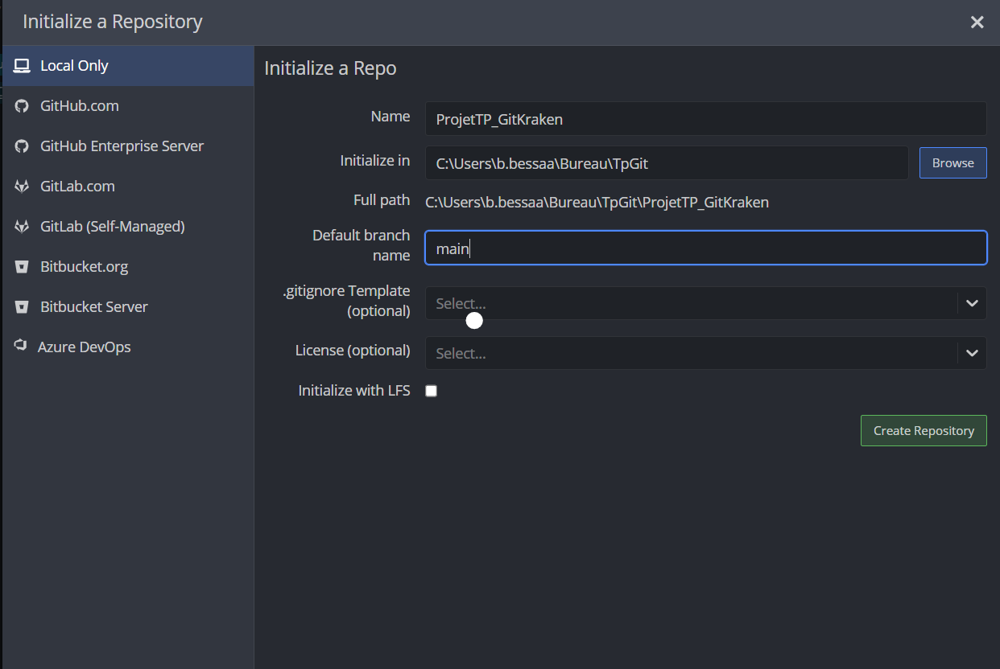
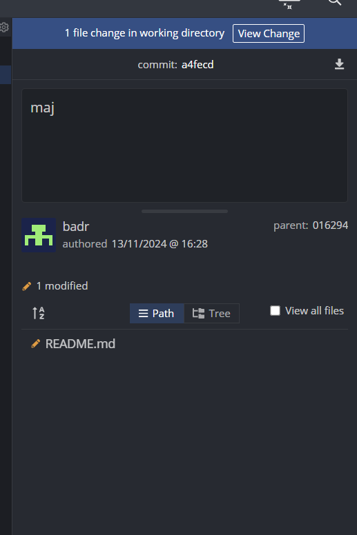
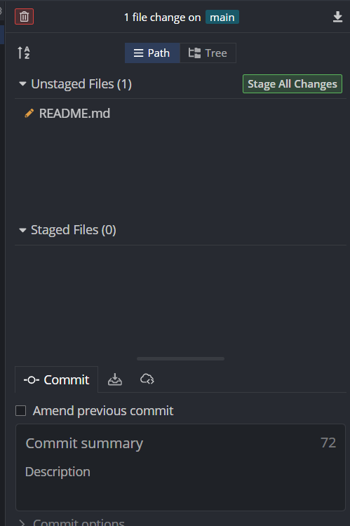
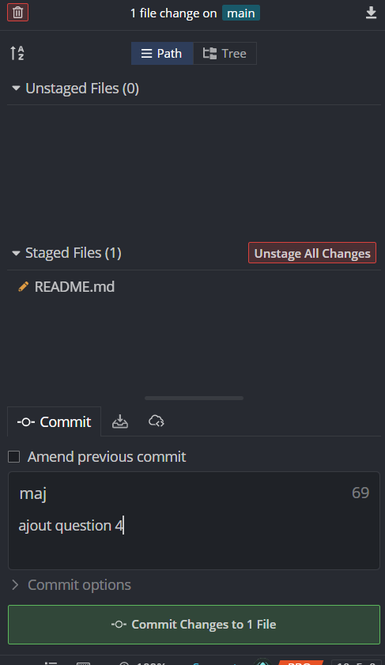
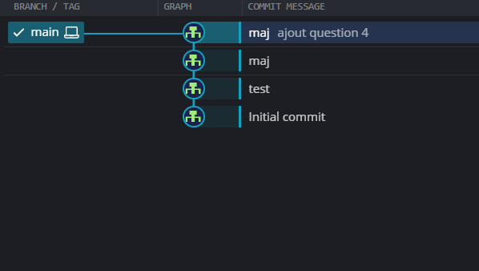
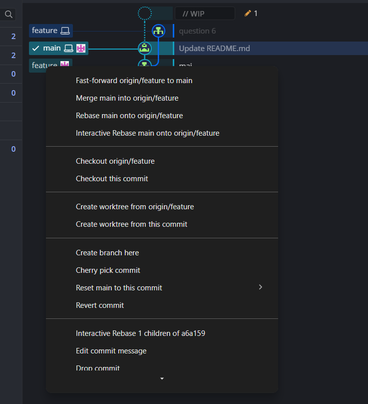
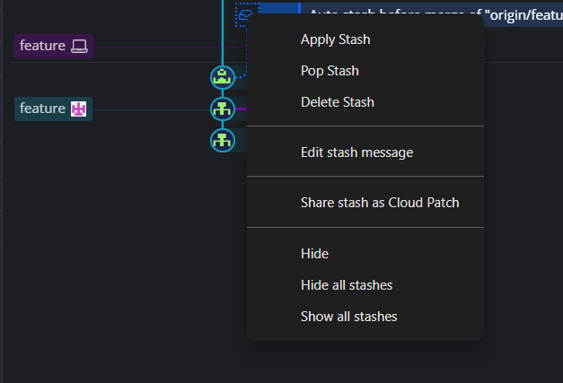
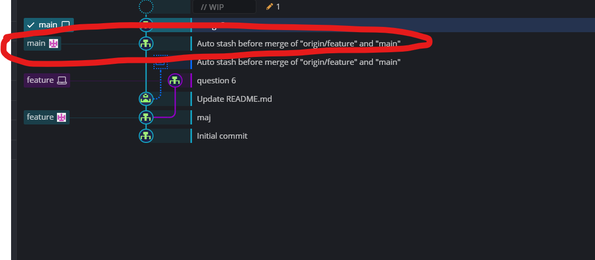

# ProjetTP_GitKraken

 ## Étape 1 :
### Question 1 :
La zone principale contient les branches et commit.  
Au dessus différents boutons comme : Pull, Push, Branch...  
À droite la zone pour commiter.

### Question 2 :

Pour crée un dépot local j'ai fais :  
- File > Init Repo > Une page s'ouvre, dans l'onglet "Local only" je rentre le nom du projet, le lien vers le dossier du projet  et le nom de la branche par défaut > Je clique sur le bouton "Create Repository"
                

Les options disponibles lors de l'initialisation du dépot sont : 
- Chosir le nom de la branche principale
- Ajout du fichier .getignore
- L'ajout d'une licence ou non (pour les droits)
- Cocher la case LFS (pour les fichiers volumineux)

## Étape 2 :
### Question 3 : 
L'interêt de crée une branche est de pouvoir travailler sur des nouvelles fonctionnalités, corrigé des bugs ou faire des tests sans impacter directment la branche du projet principal. 
Cela permet aussi d'éviter les conflits lorsque plusieurs développeur travaillent sur le projet.

### Question 4: 
Après avoir apporter des modifications au fichier Readme.md.
- 1er screen : Cliquer sur "View change" 
 
- 2eme screen : Cliquer sur "Stage All Changes"

- 3eme screen : Donner un nom au commit et une description puis appuyer sur "Commit Changes to 1 File"

- 4eme screen : On verra apparaitre le commit dans la zone principale

### Question 5 :

Il est important de pousser les branches vers le dépôt distant pour avoir une sauvegarde externe de ce que l'on fais qu'on peux récuperer en cas de soucis en local. Cela permet aussi aux autres utilisateurs d'acceder au travail envoyé. 

Pour effecuter cette opération il faut appuyer sur le bouton "Push", selectionner le dépôt distant et c'est bon.

## Étape 3 :

### Question 6 :
Un conflit Git c'est lorsque 2 branches ont des modif differentes sur les mêmes lignes d'un fichier. Cela peux survenir lorsque plusieurs personnes travaillent sur le même projet.

### Question 7 : 

#### 1ere étape :
- Se placer sur la branche main
- Faire un clique droit sur la branche feature 
- Cliquer sur "Merge main into origin/feature"

#### 2eme étape :
- Faire un clique droit sur l'icon qui est apparut dans la nouvelle ligne .
- Cliquer sur Apply stash

- La ligne entouré en rouge sera crée et les lignes du fichier Readme.md de feature seront sur le Readme.md de main.

### Question 8 : 

Un commit de merge est le commit que j'ai montré juste au dessus entouré en rouge. C'est un commit spécial qui est créé lorsqu'on fusionne une branche dans une autre et qu’il y a des différences entre les deux branches.

## Étape 4 :

### Question 9 : 

